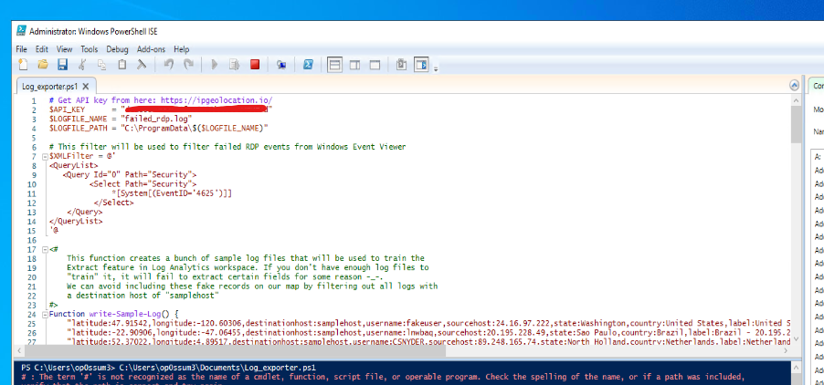

# **Azure SIEM (Security Information Event Management) (Microsoft Sentinel)**

The image is a graphic representation of this laboratory, basically, a **Windows 10 Virtual Machine** in **Azure** is our honeypot, logs of attacks gonna be stored in **Log Analytics Workspace** and if want to see or query log information we uses **Azure Sentinel**.

 # [This laboratory is inspired in this YouTube video.](https://www.youtube.com/watch?v=RoZeVbbZ0o0)

# Azure resources deploy

# 1. VM Windows 10

 

- When we creates the VM honeypot, in network settings, the option of security group, select create new, and add the next parameters, to allow inbound network traffic.

- After that configuration, we can use default parameters, to click in review and create to deploy VM.

# 2. Logs Analytics peering to Microsoft Defender for Cloud

- In **Log AnaLytics workspace** we need to peer the **Windows VM** 

 

 - In **Microsoft Defender for Cloud**, enable a plan for Servers, don't forget save.
# 3. Microsoft Azure Sentinel

 

 - Peer **Microsoft Azure Sentinel** to **Log AnaLytics workspace**
# 4. Login VM

- After login in our VM honeypot, we disable the Firewall, Domain, Private and Public Domains need to be in Off status.

# 5. Run a script in PowerShell

- This scrip uses a API from ipgeolocation.io, basically, creates a file with info about ip and location of attacks

# 6. Querys in Sentinel

- When ask to Sentinel about information, it provides geolocation and IP

- After 2 hours of deploy, numbers below correspond to attacks

- 12 hours after, our exposed VM was attacked 12200 from Indonesia, the API stop to work, because we have 10000 free queries.

# 7. Project ending

- Is a good practique, delete the resource group after we finish, if we don't delete this resources, it continous generate cost for the subscription.

- In CloudShell from Azure, to delete a resource group write : 

                  az group delete --name "resourcegroup name"

 
 # 8. Conclusion

 - It was a very informative lab, it is important to have correctly configured aspects such as Firewalls and NSG, in addition to having atypical credentials, and if possible use MFA, in order to harden the security of our resources in the cloud.